# Laboratory Work 2 - Landing Page

### Author: Gusev Roman
### Laboratory Assistant: Străinu Dragoș

## Objectives:

* Create a web page for your/friends/relatives business (example: car-rent, cookies-shop, crypto-scam)

## Requirements:
- Some form of navigation to sections (links, buttons)
- Call to action
- At least 4 sections ([see examples](https://webflow.com/blog/high-converting-landing-page))
- Pleasant to the eyes

### Dev requirements:

- Use vanilla CSS and HTML (no frameworks)
- Have a decent git history (no one commit)
- The page should be deployed on a free hosting service (example: GitHub Pages, Vercel, Netlify)
- Project repo should have a README with a short description of the landing page topic, screenshots, and a link to the live demo

### Other requirements:

- For potential maximal mark, a WIP version should be submitted during the class
- Use index.html, reset.css

## Description

* I decided to make a Landing Page for an app called MedRec, which is
a Electronic Healthcare Management System, that offers acces and manipulations with Medical Records via an Online Platform. 

* I followed the requirements and implemented several sections:
    * Navbar - I designed a navbar with the logo of the application and several CTA (Call to Action) Buttons that provide links to several sections in the page.
    * Hero - in this Section I displayed some Hero Text alongside with an image that reflects the general purpose and will catch the eye of the customer.
    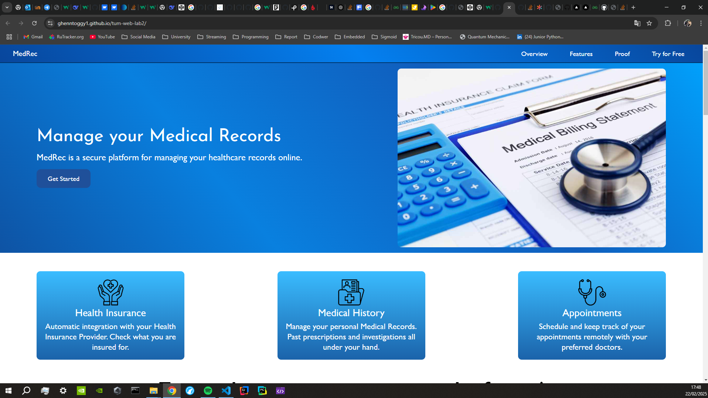
    * Overview - a small section with 3 main features / solved problems that may interest customers.
    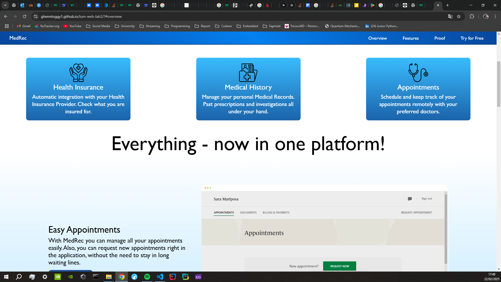 
    * Demo Functionality - in this Section I present to users the functionalities of the application with their respective demo images, and provide small description of them.
    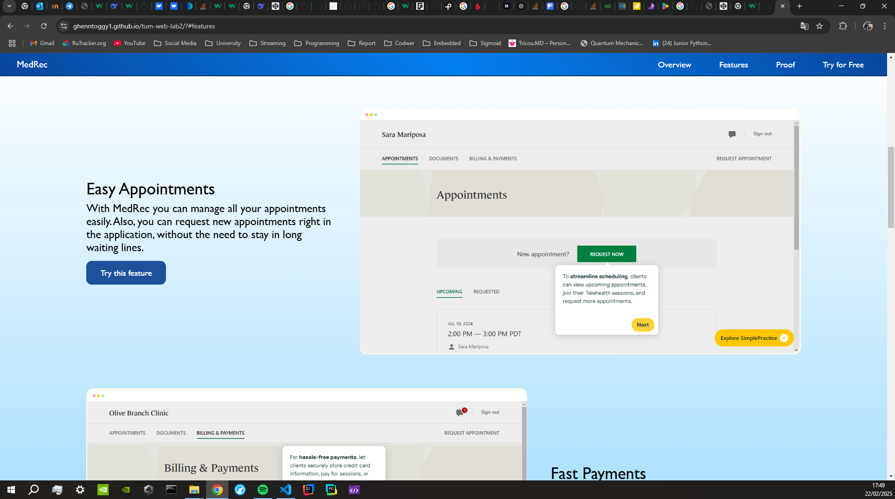 
    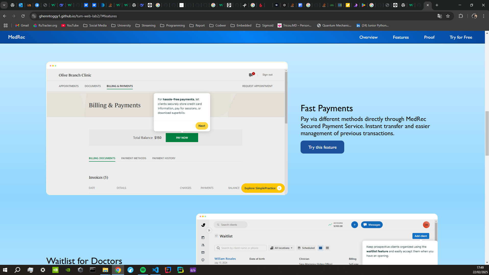 
    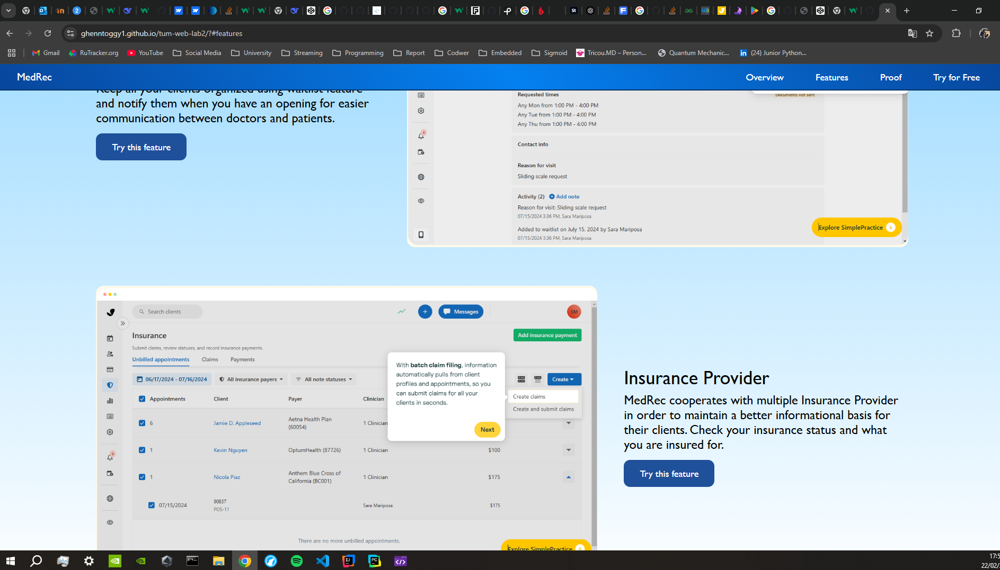 
    * Social Proof - a section with social proof of the application, that includes several rankings of the app from different sources and a series of Testimonials from Customers of the app.
    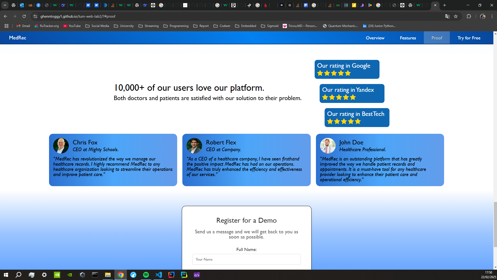 
    * Contact Form - this form presents a way to gain access to the application via a register form.
    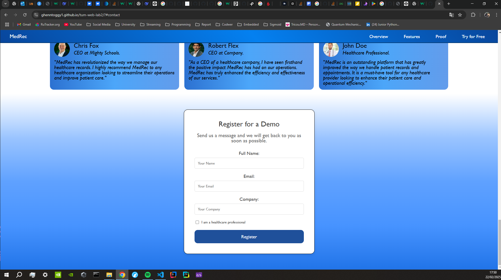 

* At the same time, I tried to implement responsiveness using @media queries in order to have a better display on small media devices:
    * Navbar and Hero

    

    * Overview

    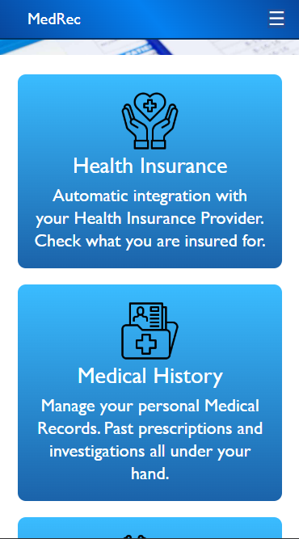 
    * Demo Functionality

    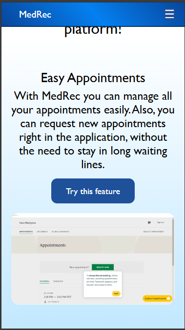
    * Social Proof

    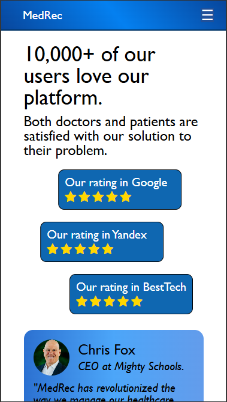 
    * Contact Form

    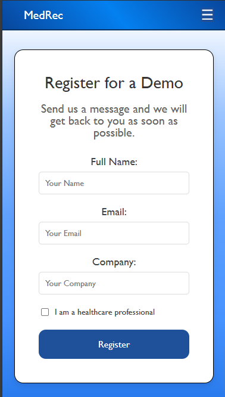 

## Conclusions
* I used only HTML and CSS in order to accomplish the task. I got in touch with many functionalities of CSS, understood better styling techniques available in CSS, such as: Hover effect, background gradient and many others.

* Link to repository: [Laboratory Work 2 - Landing Page - Github Repo](https://github.com/Ghenntoggy1/tum-web-lab2)

* Link to deployed Github Pages: [Github Pages - Laboratory Work 2 - Landing Page](https://ghenntoggy1.github.io/tum-web-lab2/)