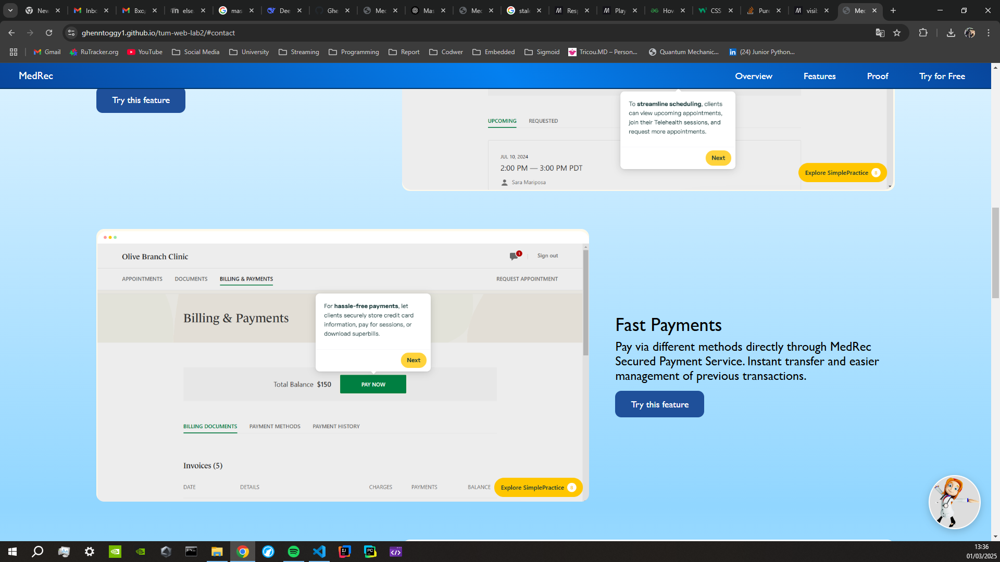
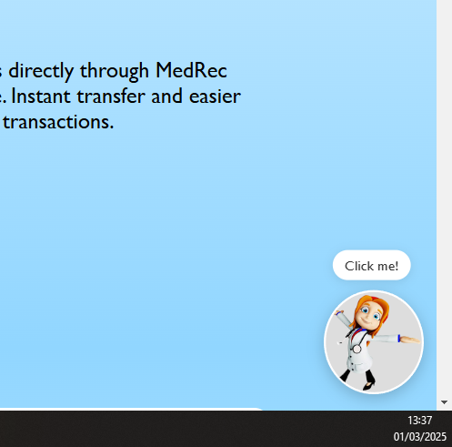
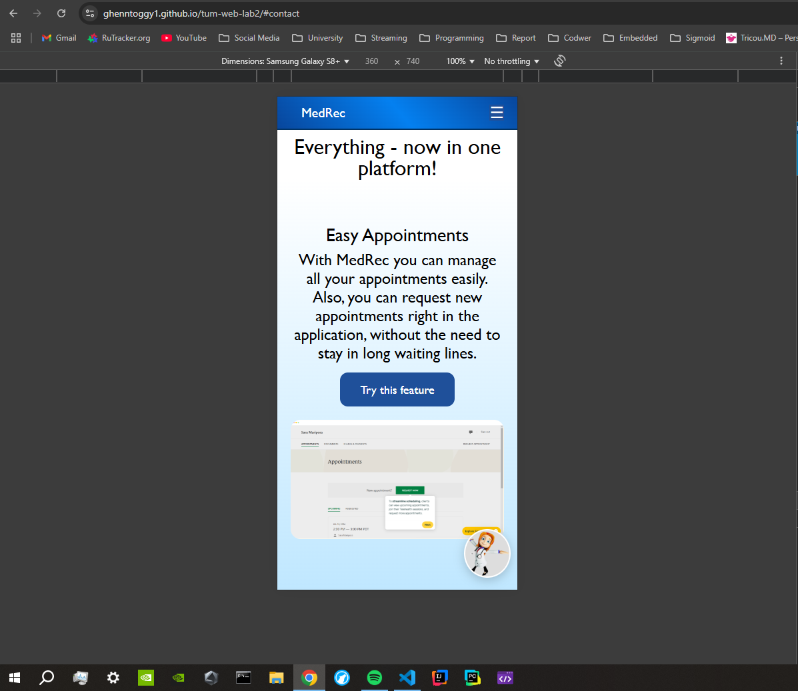

# Laboratory Work 3 - Responsiveness and Mascot

### Author: Gusev Roman
### Laboratory Assistant: Străinu Dragoș

## Objectives:

* Make the website Responsive.
* Add a Mascot that will appear after a delay.
* Add element that is visible only on one type of device (ex. Button on mobile)

### Dev requirements:

- Use vanilla CSS and HTML (no frameworks)
- Have a decent git history (no one commit)
- The page should be deployed on a free hosting service (example: GitHub Pages, Vercel, Netlify)
- Project repo should have a README with a short description of the changes on the Landing page, screenshots, and a link to the live demo

## Description

* I decided to continue working on the Landing Page for an app called MedRec, which is
a Electronic Healthcare Management System, that offers acces and manipulations with Medical Records via an Online Platform. 

* I tried to implement responsiveness using @media queries in order to have a better display on small media devices:
    * Navbar and Hero

    

    * Overview

    

    * Demo Functionality

    

    * Social Proof

     

    * Contact Form

     

* For the mascot, I decided to implement a simple one, a doctor that will appear after 5 seconds on the website:
    * Desktop:
    

    * On hover effect:
    

    * On mobile:
    

* For the element that is visible only on mobile, I decided to go with the Dropdown menu with buttons from Navbar, that looks better on mobile, since the Navbar is not crowded:

## Conclusions
* I used only HTML and CSS in order to accomplish the task. I got in touch with many functionalities of CSS, understood better styling techniques available in CSS, such as: Hover effect, background gradient and many others.

* Link to repository: [Laboratory Work 3 - Responsiveness and Mascot - Github Repo](https://github.com/Ghenntoggy1/tum-web-lab2/tree/lab_3_state)

* Link to deployed Github Pages: [Github Pages - Laboratory Work 3 - Landing Page](https://ghenntoggy1.github.io/tum-web-lab2/)